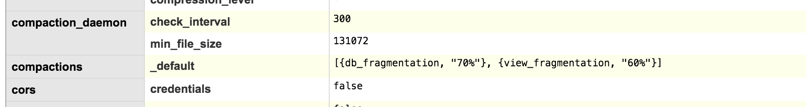

# Deploy Wizkers as a server application

Wizkers runs great as a server application. In that mode, you access Wizkers through a standard browser (Google Chrome being the reference browser for our tests).

This section describes the various database backends you can select when running Wizkers, as well as how you should configure it with reverse proxies like nginx.

## Selecting the database

Wizkers will run fine out of the box with no particular additional configuration: for instance, for the "Wizkers:Radio" flavor, a simple

```
OEM=radio gulp server
cd dist/server
./start_server.sh
```

will be enough to get you started. In that mode, Wizkers will use a disk database called LevelDB which is the default storage mechanism for PouchDB, the internal Wizkers database API.

For larger deployments where you have potentially dozens or more sensors connected at once, levelDB will not be adequate, which is why Wizkers also supports standard CouchDB servers.

The database engine is selected in `server/pouchdb-config.js` with the `backend` variable. Set it to `CouchDB` to use CouchDB rather than PouchDB (which is the default).

```
var backend = 'CouchDB';
```

Do not forget to run `OEM=XXX gulp server` again after making a change.

### Configuring CouchDB

Please head over to the [CouchDB documentation](http://couchdb.readthedocs.org/en/1.6.1/) for details on how to install CouchDB on your particular machine. Most Linux distributions already include Couch in their standard packages, so this should be very easy.

By default, CouchDB binds to the 127.0.0.1 interface, and lets anyone connect to it with no authentication. You probably do not want this for a production system, and should take the appropriate steps to secure your installation. For development purposes, this should be fine, though.

The only Wizkers-specific configuration you should do on CouchDB (and this can become critical for large number of connected sensors), is configure the auto_compaction daemon so that there are no runaway databases due to frequent document updates. This can be done from the admin interface of couchdb at `http://127.0.0.1:5984/_utils`. From this interface, head over to "configuration" (menu on the right) and add the configuration for compactions: at the bottom of the page, click on the "add a new section" link, and enter the following:

- Section: compactions
- Option:  _default
- value: `[{db_fragmentation, "70%"}, {view_fragmentation, "60%"}]`



This way, CouchDB will make sure that even with frequent document updates, the overall database size does not get out of hand.

### Migrating from Pouch to Couch

If you started your deployment with PouchDB and later decided to migrate to CouchDB, a script in the `server/utils` directory will automatically migrate all your data and settings to CouchDB.

First of all, make sure Wizkers is not running. Then go to `dist/server/utils` and launch `node migrate_to_couchdb.js`. The process should take from a couple of seconds to a couple of minutes depending on how much data you have in your database.

Last, make sure that the `backend` variable in `dist/server/pouchdb-config.jg` is set to `CouchDB`, then relaunch Wizkers. You should be able to login exactly like before.

## Wizkers auto start

On a Linux distribution, you will probably want to have Wizkers automatically start when the device/computer boots. The init scripts below give you an example of how to do this. Tweak as needed!

On recent Ubuntu distributions, you will need to create a `/etc/init/wizkers.conf` script. Note that you can enable debugging output in `/tmp` or not, this is optional...

```
# Ubuntu upstart file at /etc/init/wizkers.conf
 
start on runlevel [2345]
stop on runlevel [06]

setuid ubuntu

script
  export HOME="/home/ubuntu/wizkers/server/dist/server"
  ENABLE_CONTROLLER="yes"
  export DEBUG="wizkers*"
  DAEMON_ARGS="/home/ubuntu/wizkers/server/dist/server/server.js"
  if [ -f /etc/default/wizkers ]; then . /etc/default/wizkers; fi
  if [ "x$ENABLE_CONTROLLER" = "xyes" ]; then cd $HOME; exec node $DAEMON_ARGS > /tmp/wizkers.log 2>&1 ; fi
end script
```

On Debian-style distributions such as Raspberry Pi's "raspbian", you will need to create /etc/init.d/wizkers as shown below. Don't forget to adjust the path where Wizkers is located:

```bash
#!/bin/sh
# kFreeBSD do not accept scripts as interpreters, using #!/bin/sh and sourcing.
if [ true != "$INIT_D_SCRIPT_SOURCED" ] ; then
    set "$0" "$@"; INIT_D_SCRIPT_SOURCED=true . /lib/init/init-d-script
fi
### BEGIN INIT INFO
# Provides:          wizkers
# Required-Start:    $network $local_fs $remote_fs $time
# Required-Stop:     $remote_fs
# Default-Start:     2 3 4 5
# Default-Stop:      0 1 6
### END INIT INFO

# Author:  Ed Lafargue <ed@wizkers.io>
#

export PATH=$PATH:/usr/local/bin
DESC="Wizkers server"
DAEMON=`which node`
DAEMON_ARGS='/home/pi/wizkers/wizkers/dist/server/server.js'
export DEBUG=wizkers:*,att

test -x $DAEMON || exit 0

case "$1" in
	start)
	log_begin_msg "Starting Wizkers"
        cd /home/pi/wizkers/wizkers/dist/server
	# Export the NODE_PATH variable to tell node where to get its modules
	export NODE_PATH=.
        export NOBLE_MULTI_ROLE=1

# Shortcut to (again) help node find the modules that are from the web
# root:
if [ ! -e app ]; then
    ln -s www/js/app .
fi

	NOBLE_MULTI_ROLE=1 node server.js 2>&1 | logger -p local0.info -t wizkers &
	log_end_msg 0
	;;
	stop)
	;;
	restart|force-reload)
	$0 start
	;;
	status)
	$PROGRAM –show
	;;
	*)
	log_failure_msg "Usage: $PROGRAM {start|stop|restart|force-reload|status}"
	exit 1
esac

exit 0
```

# Wizkers behind a proxy

In a production environment, you will want to run Wizkers behind a web server that will be running on port 80. NGINX or just Apache 2 are two good choices:

## NGINX

To be detailed

## Apache2

On Apache2, a 'sites-available' configuration that is adequate to run Wizkers is as follows. This works for Apache 2.4 + with mod rewrite and mod proxy enabled. The trick being to handle socket.io in websockets mode without having it fall back into http polling mode.

You will need to enable a couple of apache2 modules to make the configuration below work

```
a2enmod rewrite proxy proxy_http proxy_wstunnel
```

```
# Setup for Wizkers
<VirtualHost *:80>

    ServerAlias *

    RewriteEngine On
    RewriteCond %{REQUEST_URI}  ^/socket.io            [NC]
    RewriteCond %{QUERY_STRING} transport=websocket    [NC]
    RewriteRule /(.*)           ws://localhost:8090/$1 [P,L]

    ProxyPass /aprs !
    ProxyPass / http://localhost:8090/
    ProxyPassReverse / http://localhost:8090/

</VirtualHost>
```
