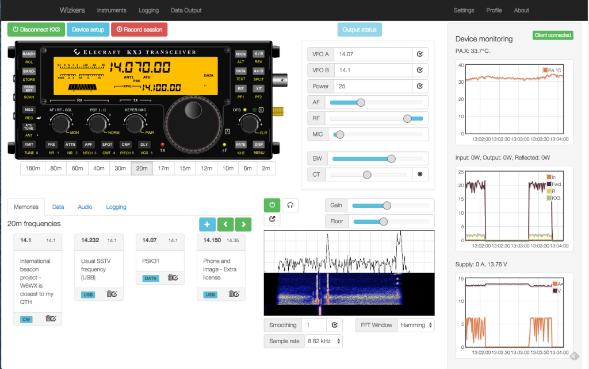

# Wizkers documentation

Wizkers is a universal open source application for both data visualization and control of various kinds of scientific instruments. It is a full Javascript/HTML5 application which runs on nearly any computer, phone or tablet.

It can also run as a standalone server application, on any Linux platform, from a simple Raspberry Pi or Beaglebone black, all the way to cloud-hosted AWS instances, which gives it tremendous flexibility. Basically, it is a real open source simple 'cloud' system  and one of the only 'cloud' projects out there with a fully open source (GNU Affero General Public License) front-end _and_ backend.

Out of the box, Wizkers supports a variety of instruments, and it can easily be extended to support additional devices.

This documentation covers both [user instructions](userdoc.md) and [developer docs](devdoc.md).

## What can Wizkers do?

At the core, Wizkers is designed to interface with various kind of sensors and scientific instruments and visualize and record their data. Wizkers lets you:

* Visualize the readings coming from your sensors and instruments
* Record those readings
* Forward the readings to a variety of backends - from HTTP REST APIs to WebRTC
    * You can use this capability to forward data to IoT services, and remain independent
* Remotely control and configure the sensors and instruments connected to it

## Who is Wizkers for ?

Wizkers is an ideal fit for anyone building or using measurement instruments, as it provides all the necessary capabilities to create an instrument utility that works on any operating system or device, is easy to maintain and fast to deploy. This enables instrument and sensor designers to focus on their project without spending too much time on the software part, and still create a best of class interface.

Wizkers is also a great solution for any sensor deployment project where there is a desire to be truly independent from third party service providers, or the deployment occurs in regions where 24/7 Internet connectivity is not a given. For this reason, Wizkers is popular with NGOs.

## Why Wizkers ?

Wizkers came to life for a couple of simple reasons:

* Most lab instruments have no decent computer utilities even though they have great connectivity. Those utilities are usually less than user-friendly, Windows-only, and poorly supported.
* It is becoming easier and easier to create and use many small and not-so-small sensors that generate data, but finding good ways to record, visualize and analyze their output, and remotely configure and control them with an engaging interface is often an afterthought.
* Most IoT services are all about 'dumb' sensors and easy and free APIs, but at the cost of a completely closed backend and limited control on your data once it is sent over. Basically, you are only getting access to half of the infrastructure, and the arguably most critical part is outside of your control. But there are many situations where you want to be able to deploy your own infrastructure without having to rely on a third party, especially if you are not deploying millions of sensors, or you cannot do 24/7 connectivity for some reason.

Another issue we have experienced many times over the last few years, is that most IoT startups cannot provide any kind of continuity and stability for a project: from Pinocc.io to Pachube, Spark.io, Helium.com, etc, most of those companies tend to review and modify their business model every couple of months, and put any project that relies on them at great risk.

Wizkers solves all this issues with one elegant framework: In a nutshell, Wizkers is both the missing link between your sensors, your instruments and the Cloud, as well as the missing universal utility for scientific instruments which works on any OS and any computer.

## Wizkers overview

### Supported instruments

The following instruments are currently supported in Wizkers (as of August 2015):

Instrument name                          | Chrome App       | Android App  | Server      |
:----------------------------------------|:-----------------|:-------------|:------------|
Medcom Onyx                              | Yes              |  Yes         |  Yes        |
Medcom Geiger Link                       | Yes              |  Yes         |  Yes        |
Medcom Blue Onyx                         | Chromebooks only |  No          |  No         |
Medcom Hawk Nest                         | -                |  -           |  Yes        |
Elecraft KX3                             | Yes              |  Yes         |  Yes        |
Remote KX3 (Wizkers to Wizkers)          | Yes              |  Not tested  |  Not tested |
Fluke 287/289                            | Yes              |  Yes         |  Yes        |
Fried Circuits USB tester OLED backpack  | Yes              |  Yes         |  Yes        |
Simple serial terminal                   | Yes              |  Yes         |  Yes        |
Sark 110 antena analyzer                 | Yes              |  Yes         |  Yes        |
Kromek Sigma 25                          | Yes              | Yes          | Yes         |

### What if my instrument is not supported ?

We can help! If you are a developer, you can head over to the [developer documentation](devdoc.md) and get started. You can also contact us at [info@wizkers.io](mailto:info@wizkers.io) and find out how we can help.

## Wizkers and Open Source

Wizkers is a fully open source project, released under the terms of the GNU Affero General Public License. The Affero version of the GPL means that if you use Wizkers in any manner (including by running it or offering it as a service), you must make the full source code, including any modifications you did available to all your users.

Wizkers also uses a variety of third party libraries which are released under multiple license schemes, but are all compatible with this global license.

## Installation instructions

Below are installation instructions for the three run modes supported on Wizkers:

### Chrome packaged app

Wizkers can be [downloaded](https://goo.gl/DgLqXH) from the Chrome app store, and is available on any computer that can run Chrome. This includes MacOS, Linux and Windows. 

Chrome packaged apps rely on the Chrome runtime to run - this means you need to have Google Chrome installed on the computer - but otherwise behave as native applications.

### Android app

Wizkers will eventually be available on the Google Play store, but in the mean time, you will have to build Wizkers for Android yourself (refer to the [developer documentation](devdoc.md) for details on how to do this).

### Server

You can also run Wizkers as a standalone server. You then interact with a running Wizkers instance using a web browser. The advantage of running Wizkers in this mode, is that you can leave it connected to instruments 24/7. Server mode supports advanced features such as user management and user rights, multiple open instruments at the same time.

Refer to the [developer documentation](devdoc.md) for instructions on how to checkout Wizkers from Github and build the server version.
