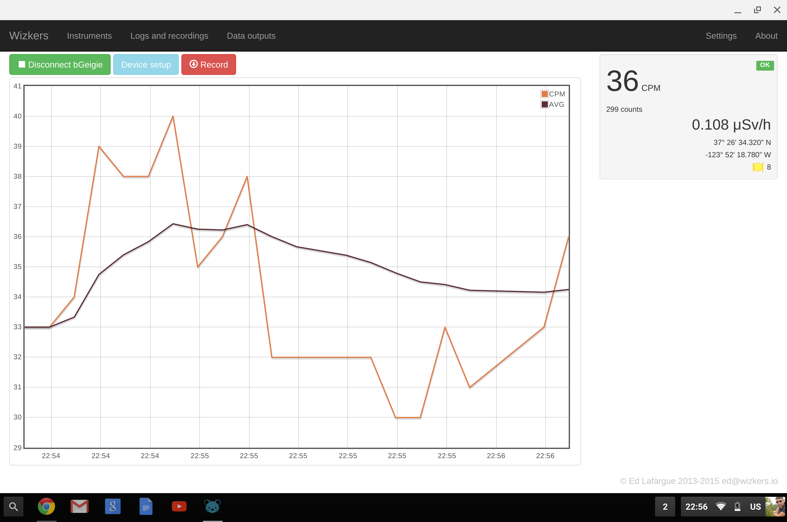

# Safecast bGeigie Nano

The bGeigie Nano is a portable Geiger counter / logger designed by [Safecast](http://www.safecast.org/). The full story behind the bGeigie is fascinating, as it was created as a rapid response instrument after the Fukushima Daiichi nuclear accident, and is really a brilliant 'no nonsense' design.

Hundreds of bGeigie units have been built so far, and they can all be equipped with Bluetooth Low Energy modules for serial communications.

Wizkers supports the bGeigie when running on a Chromebook, or as an Android app, as long as the Android device supports Bluetooth Low Energy.

### The main screen (Chrome)

On Chromebooks, the bGeigie Nano instrument displays pretty much the same data as the Onyx, except that the GPS coordinates come from the bGeigie and not the localization API of Chrome.

Due to content policy restrictions on Chrome, there is no mapping support for the bGeigie yet, though a future revision of Wizkers will probably add this.

### The main screen (Cordova app / Android)

Mapping is enabled by default in Android mode. Wizkers displays the trace on the map using color dots that go from white to red depending on the CPM value.

