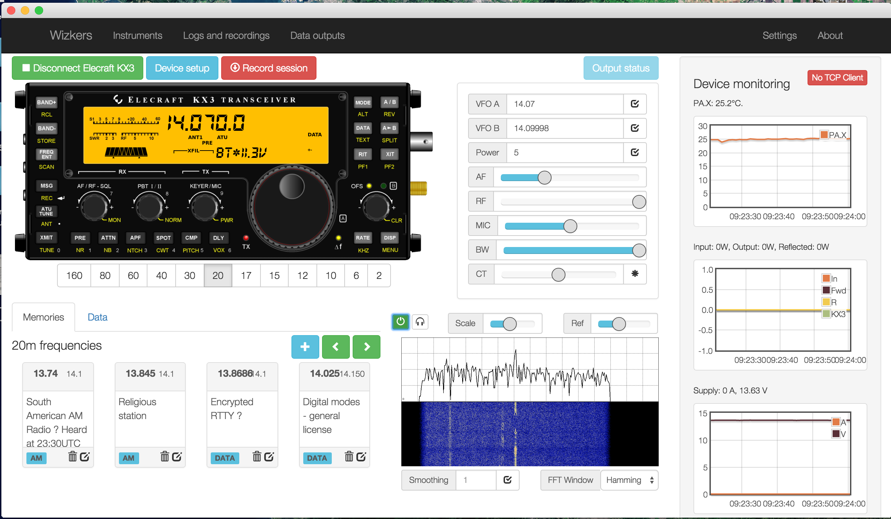
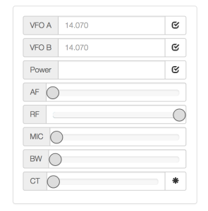
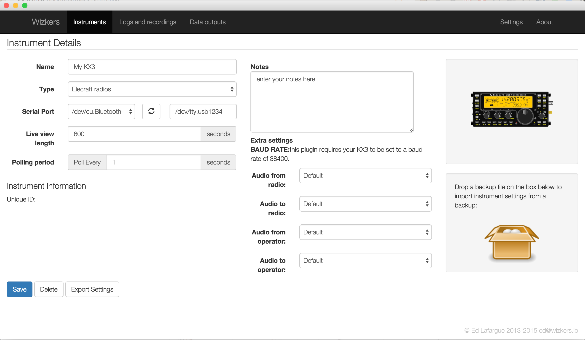

# Elecraft KX3

The KX3 instrument plugin gives you pretty extensive rig controller capabilities from your computer. The first and foremost feature of this plugin is the reproduction of the KX3 faceplace – you can click on the buttons, nearly everything works:

What's more, you get access to features that are either not directly supported or a bit involved to work with on the KX3 such as:

* Memory Management
* Monitoring of KXPA100 health
* Direct frequency access
* TX and RX equalizer setup

And when used with the "rigctld" output plugin, you can use Wizkers as the rig controller for third party software such as fldigi.

## The main screen

### The KX3 Faceplace

Not much to say there: most buttons work as they should – click on the text below the buttons for accessing those functions which are usually accessed by “holding” the buttons.

The display mostly works, a few elements are not kept in sync, most notably the SWR. This will be implemented in a future revision.

### Direct input area

In this area, you can enter VFO A and VFO B frequencies, select input power, and adjust AF gain, RF attenuation, Mic gain, filter bandwidth and center frequency. Press the `*` button to recenter the filter.

### Waterfall display

The waterfall display is the most recent feature of this plugin. It is an Audio (not IQ) display, and uses the computer’s default sound input. Press the small "power" icon on the upper left to start the waterfall. The Headphones icon sends the audio to the computer’s speakers, which is good for monitoring in digital modes, for instance.

The "Scale" and "Ref" controls let you change the rendering of the waterfall. Smoothing and FFT window are further controls to fine-tune how the waterfall looks.

## Device setup

On the "Instruments" screen, create a new "Elecraft Radio" instrument, as shown below. Most of the fields are self-explanatory:

* Pick the correct serial port
* If you are planning to connect your radio audio to the KX3, you can also setup your sound cards here

### Sound card setup

The KX3 instrument gives you the ability to visualize the audio from the KX3 on a "waterfall" display, as well as monitor the audio on the computer. It can also send audio coming from your computer (a microphone for instance) to the radio. This is convenient since the radio's audio input and output are connected to your computer, to it is not possible to connect your microphone to the radio anymore.

For doing this, you will need to setup the "audio from radio" and "audio to radio" drop-downs to indicate which sound card the radio is connected to. And you can use the "audio from/to operator" dropdowns to indicate the sound card used by the operator.

Note that making full use of this setup requires two sound cards, but you can choose to simply setup the "audio from radio" and "audio to operator" dropdowns to do a simple monitoring when working on digital modes.

