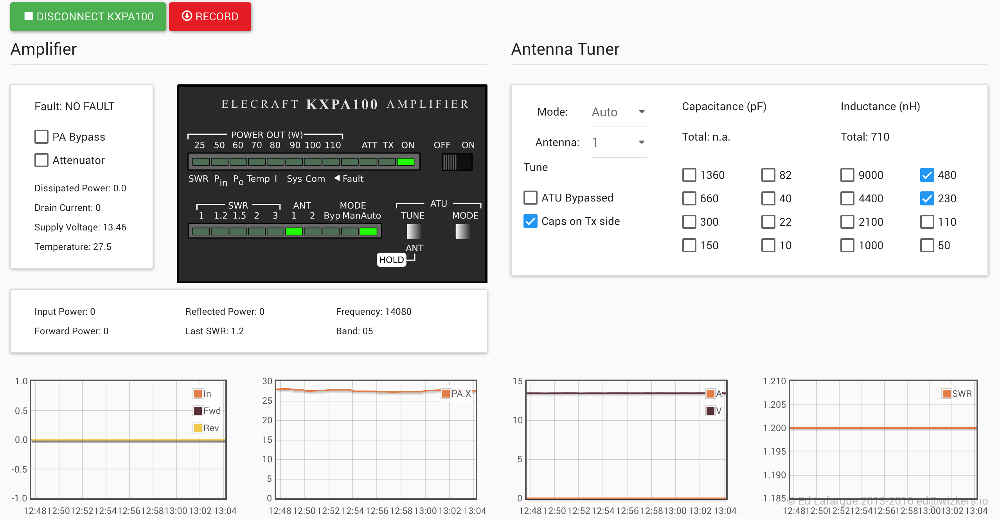

# Elecraft KXPA100

The KXPA100 instrument plugin is a complete interface for monitoring and configuring the Elecraft KXPA100 HF amplifier.

Nearly all LEDs on the front panel monitor are functional, so you can get a display of the KXPA100 even when it is located far away.

You can either use the KXPA100 monitor along with a KX3, in which case you can access it through the "Device Setup" screen, or simply in standalone mode, in case you are using the KXPA100 without a KX3. In that case, just configure it as a standalone instrument through the "Instruments" screen.

## The main screen

### The KXPA100 faceplate

As mentioned above, most LEDs on the faceplate follow the LEDs on the KXPA100 display - the only LED that is not implemented at the moment is the "TX" led.

Two LED brightness levels are used, in order to avoid polling the KXPA100 too fast but still provide great visual feedback

### AMP and ATU Configuration

As shown on the screenshot above, you can control pretty much every aspect of the configuration of the KXPA100 by directly clicking on the checkboxes and dropdowns. Changes are done instantly.

### Parameter Monitoring

The bottom of the screen displays four graphs:

* Power: input, forward and reflected power
* Temperature
* Voltage and current
* SWR

### Evolutions

In a future release, the KXPA100 monitor will also display the fault history.