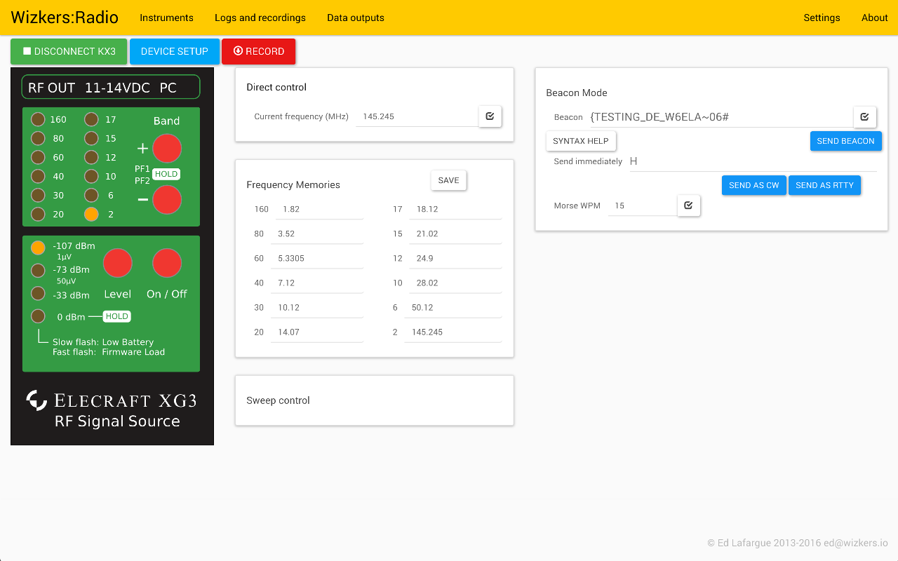

# Elecraft XG3

The XG3 instrument plugin lets you configure and operate the Elecraft XG3 RF signal source. One of this really nice features is that it makes it very simple to operate the XG3 in CW or RTTY beacon mode, which is not very easy when just interfacing with the XG3 Elecraft utility or a serial terminal.

## The main screen

### The XG3 faceplate

The XG3 faceplate is active. In particular, in order to select a band memory, simply click on the LED of the band you want to select. Same thing for the output levels.

Note that the red buttons are not active yet.

### Direct frequency selection and memory edit

You can select a frequency directly in the "Current frequency" field.

The monitor screen displays the frequency of all band memories. You can modify any memory and press "Save" to send the changes to the XG3. Note that Wizkers is 'smart' and will only send actual changes to the XG3 and will not overwrite a memory for unchanged memories.

### CW/RTTY beacon

The "Beacon Mode" panel lets you define the beacon string. The XG3 supports quite a few special characters as part of the beacon string, and the monitor can display a quick 'cheat sheet' by pressing "Syntax Help".

Note that when clicking "Send Beacon", the XG3 PF1 memory is automatically reprogrammed to activate beacon memory. The XG3 will send the beacon (continuously if the beacon ends with '#') until a command is sent to the XG3, for instance by changing the band.

The XG3 can also send an arbitraty string of characters in CW or RTTY mode using the "send immediately" field.

### Sweep mode

Sweeps are not implemented on this version yet!