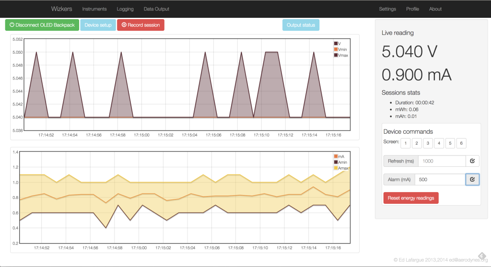

# Fried Circuits OLED Backpack

This plugin really unlocks the potential of this great instrument: the OLED backpack actually contains pretty sophisticated code that monitors current/voltage fluctuations within each sampling period. The build-in monochrome OLED screen is too low resolution to visualize this, but Wizkers is able to create great graphs, as shown below:

On the right side of the screen, you can adjust the sampling rate of the backpack, from 150ms to several seconds per sample. You can also set the alarm level (current above which the blue LED switches on), and manually switch screens on the backpack.

## Firmware Upgrade

One exciting feature of this instrument, is that you can upgrade the OLED backpack firmware directly from Wizkers: go to "Settings", and click on "Firmware Upgrade", the rest should be fairly self-explanatory.

You can either pick a pre-compiled firmware package ("Hex" file), or click on "Download" to automatically fetch the latest firmware from Fried Circuits. Once the firmware is ready and checked by Wizkers, the "Download" button will turn green and you can upgrade the backpack’s firmware, which takes about 10 seconds…