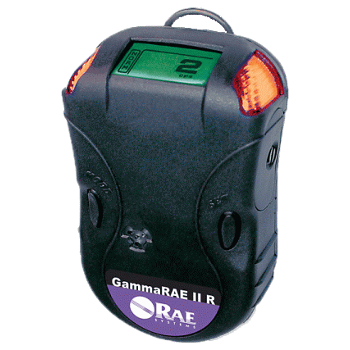

# RAE Systems / Honeywell GammaRAE II R

The [GammaRAE II R](http://www.raesystems.com/products/gammarae-ii-r) is a High-performance personal gamma radiation detector and full-range dosimeter from RAE systems.

This device includes a Bluetooth interface which enables communication for downloading the current dose and receive a variety of information.

Note that there is apparently no way of getting live readings over Bluetooth. The interface is over classic bluetooth, not Bluetooth low energy.

## Support status

The GammaRAE II is supported on any system that supports Bluetooth, including Android. On Windows or MacOS, the GammaRAE appears as a standard serial port over bluetooth.

Note that it seems that due to firmware limitations on the GammaRAE, the unit requires getting paired again at each new connection (pairing code is 1234)

Wizkers.io app   | Support                                        |
:----------------|:-----------------------------------------------|
Framework level  |  Not available on open source version. [Contact wizkers.io](http://www.wizkers.io/buy-or-diy/) for details.         |
Wizkers:Nuclear  |  Android, Server, tested on MacOS             |

## Supported capabilities

Currently (Mid 2017) only a couple of capabilities are supported on the GammaRAE:

- Operational status
- Running parameters (date, background calibration date, etc)
- Current dose

There is no support for downloading device logs so far

## Main screen

