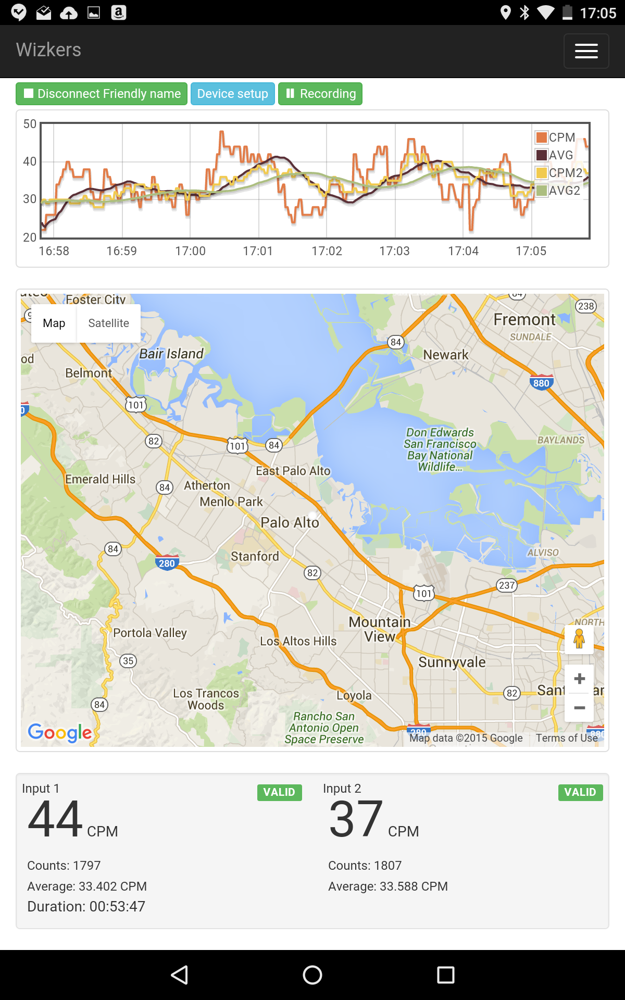

# Medcom GeigerLink

The GeigerLink is one of the newest additions to the Medcom family. Geigerlink interfaces with all the geiger counters produced by Medcom and any third party geiger counter equipped with a pulse output connection.

GeigerLink is fully supported by Wizkers, and turns any Geiger counter into a powerful graphical logger.

## Wizkers support

On Wizkers, you can not only plot and record readings coming from the geiger counter through the GeigerLink, but also configure all its settings.

## Android version

The Android version offers all the same features as the Chrome or server version of Wizkers, and also adds geolocation support through the GPS of the Android device:

