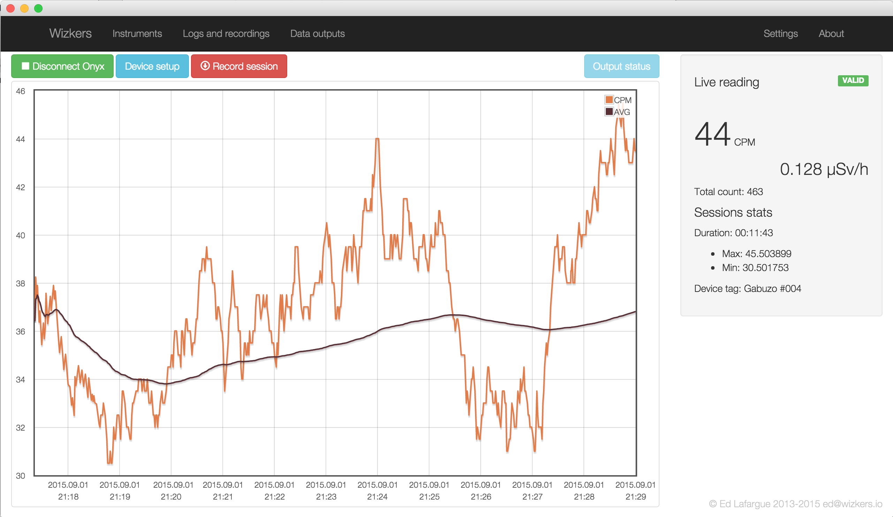
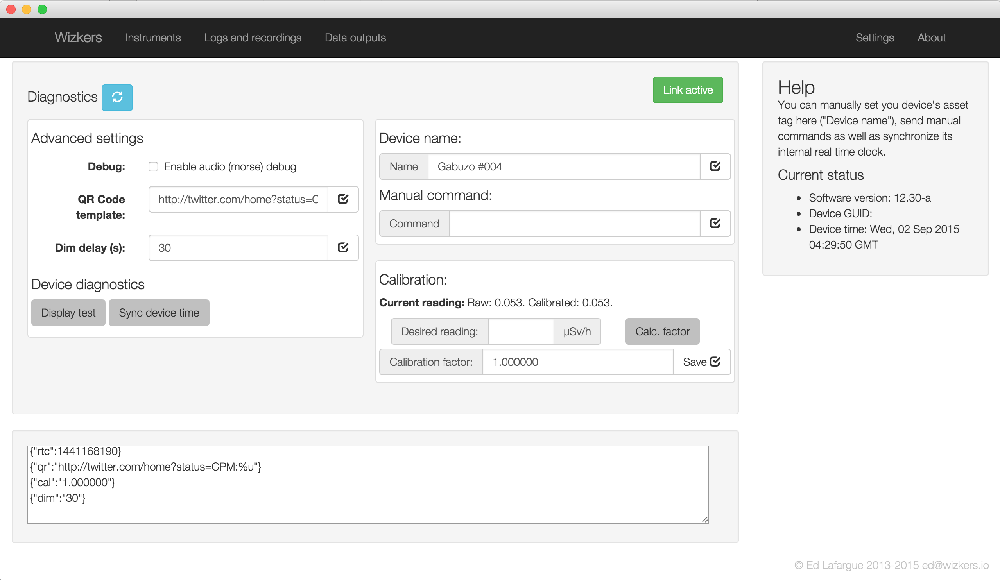
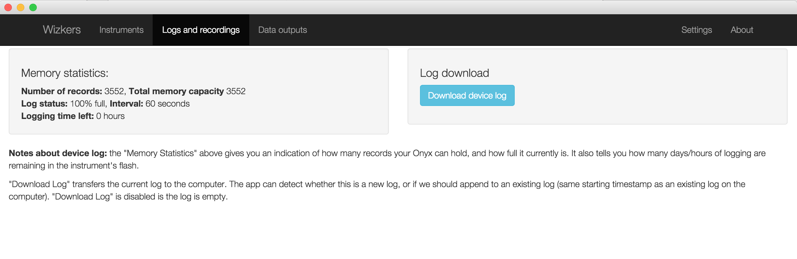
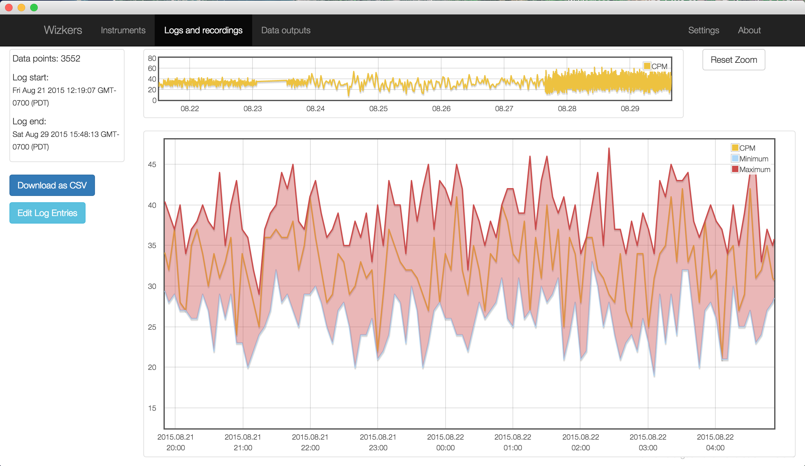
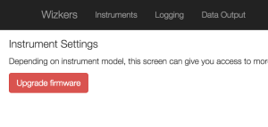
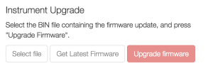

# Medcom Onyx

The Onyx is a state of the art Geiger counter, based on an Open Source design by [Bunnie Huang](http://bunniestudios.org/). What puts it apart from other open source Geiger counter designs, is that the Onyx is built, calibrated and supported by [International Medcom](http://medcom.com/), one of the most respected names in the nuclear detection industry.

Wizkers is the official utility for the Medcom Onxy and is guaranteed to support all its capabilities.

Wizkers displays the current and historical radiation graph on the main screen, can record the output of the Onyx at any rate, and regularly upload radioactivity values to backend services, including Safecast. Wizkers also support configuring the Onyx, remote calibrations as well as device log data downloads.

Last, it also lets you update the firmware of the Onyx.

## Support status

The Onyx is supported on all existing target platforms as long as they support USB. This includes USB OTG for Android devices

Wizkers.io app   | Supported | Notes              |
:----------------|:----------|:-------------------|
Framework level  | Yes       | All platforms      |
Wizkers:Nuclear  | Yes       | All platforms      |
Safecast:Drive   | Yes       | All platforms      |


## The main screen

The main screen of Wizkers when connected to an Onyx is similar to what you will see with most other supported Geiger Counters:



The main graph displays instant CPM readings (in orange) as well as a rolling 10 minute average (in dark brown). The side display shows the current CPM and µSv/h readings, as well as a "valid/invalid" pill which reflects the status of the Onyx.

## Device Setup

Since Wizkers provides official support to Medcom for the Onyx, nearly all the capabilities of this device are supported in the Device Setup screen



## Log downloads

The Onyx can store 3000+ recordings in its flash memory. You can download the logs from the "logs and recordings" screen. Wizkers supports all Onyx log formats, including single datapoint logs, and min/max logs.




## Log display

The "Logs and recordings" screen lets you visualize both Wizkers recordings and downloaded device logs.

Depending on the logging mode on the Onyx, logs will be displayed either as a single recording, or as minimum/maximum limits and recording, as shown below:



You can also save any log in CSV format by clicking on the "Download as CSV" button.

## Firmware upgrades

_Note:_ firmware upgrades have been tested on Wizkers running on Chromebooks, MacOS, as well as Windows on all version from XP to Windows 10.

Starting with Onyx firmware 12.26-b, it is now possible to upgrade the firmware of the Onyx directly from Wizkers. 

_Important:_ if your Onyx firmware version is lower than 12.26-b, you will need to do one final manual upgrade to get it up to date, by following the "Recovering from a failed upgrade" procedure described just below.

If your firmware is 12.26-b or more recent, simply head over to the "Settings" screen, then click on "Upgrade Firmware", as shown below:



Wizkers will first verify that the existing Onyx firmware can be upgraded, then, if successful, will let you either manually select a firmware file on your hard drive, or download the latest version of the Onyx firmware directly from the Wizkers firmware service.



You can then press “Upgrade Firmware” (it should turn green once Wizkers is happy with the firmware file or download).

Do not switch screens once the firmware upgrade starts, it will crash the upgrade process and the Onyx will be temporarily ‘bricked’. Which brings us to the next section: recovering from a failed firmware upgrade.

### Recovering from a failed upgrade

If for any reason, the firmware upgrade process is not successful, the Onyx screen will remain blank and the unit will not react to its power/standby switch anymore. Fear not, though, you can recover from this fairly easily. Depending on the operating system you are using, the procedure will be slightly different. Please note that at the moment, it is not possible to recover from a failed upgrade from a Chromebook, you will need a Mac, Linux or a Windows computer.

#### Recovering on MacOS X

In order to recover from a failed upgrade, you will need access to the two files below:

* [Onyx firmware loader (MacOS)](https://www.dropbox.com/s/yq0rj3h6m8on6of/fwload.zip?dl=0)
* [Onyx firmware](https://www.dropbox.com/s/tr8q97666qmeufx/onyx-firmware.bin?dl=0)

You then need to uncompress the Onyx firmware loader in your home directory. Also put the firmware file in the same location. The rest takes place on a terminal: launch the “Terminal” application and follow the procedure below:

1. Unload the FTDI drivers from the MacOS kernel:

```bash
sudo kextunload -b com.apple.driver.AppleUSBFTDI
```

This command works on MacOS Yosemite and later. If you are running an older version of MacOS, please replace com.apple.driver.AppleUSBFTDI with “com.FTDI.driver.FTDIUSBSerialDriver”.

You might get an error at this stage, but this is nothing to worry about, the driver is unloaded anyway.

2. Do the firmware recovery (please use the correct name for the firmware file, 12.26-c is used here as an example)

```bash
chmod a+x fwload
./fwload -f firmware-12.26-c.bin
```

Recovery takes about two minutes, you will see a progress indicator move slowly. If the utility complains it cannot find the Onyx, please unplug it, wait a couple of seconds, then replug it and retry the last step (./fwload -f firmware-12.26-c.bin)

You should now be up and running again.

3. Reload the MacOS FTDI drivers so that the Onyx serial port is available again:

```bash
sudo kextload -b com.apple.driver.AppleUSBFTDI
```

Again, this is for Yosemite and later, use “com.FTDI.driver.FTDIUSBSerialDriver” for earlier MacOS versions.

#### Recovering on Windows

Recovery on Windows is done with a different utility, and the same firmware file: firmware 12.26-c and the OnyxLink utility are bundled in the ZIP file below:

* [OnyxLink](https://www.dropbox.com/s/8b6xmgl3swdxzvf/OnyxLink.zip?dl=0)

Once you have downloaded OnyxLink.zip, extract it to your desktop, and run the “OnyxLink” application, to do a firmware upgrade using firmware.12-26-c.bin and get back on your feet . You will then be able to use Wizkers to upgrade to the latest firmware.
