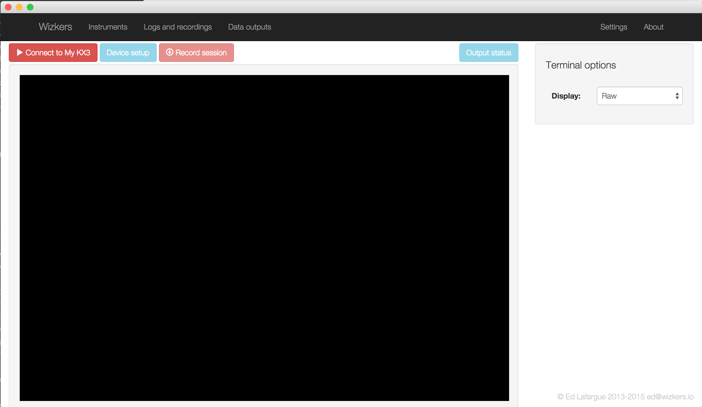

# Simple serial terminal

Sometimes, you just want to hook up a serial device to your computer and check if it works: this is exactly what the simple serial terminal is for.

## Terminal settings

So far, the simple serial terminal does not support many settings, only a switch between "raw" mode and "Hexadecimal" which will output the data as a Hex dump.