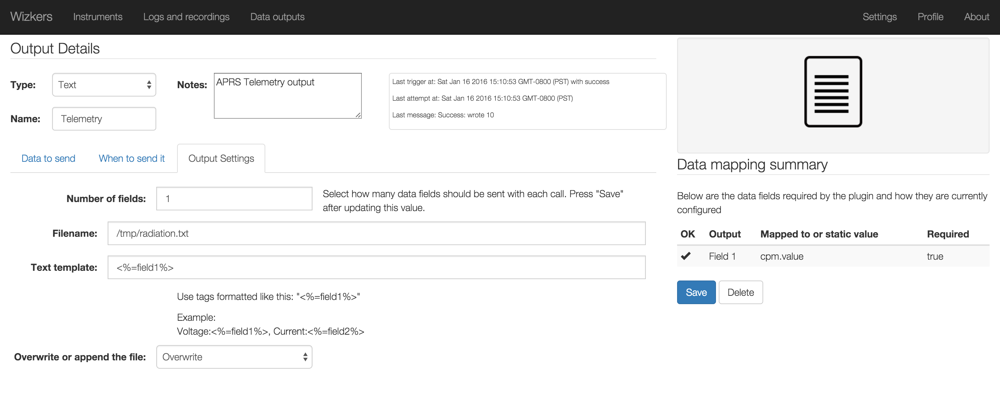

#Text output

The text output plugin is simple but very effective: it will regularly create - or append to - a file with the data fields of your choice.

This makes it possible to either create flat log files for later analysis, or more interestingly, interact with external processes which will read those files and process the data in real time.

##Configuration

The text output works with a simple tag style template which lets you create lines containing the fields of your choice. You can setup the location of the output file, as well as whether Wizkers should append to the file or overwrite it at each plugin trigger.

The example above shows how Wizkers can be setup to simply write an instrument value (radioactivity in this case) so that an external program can use it (direwolf in this case, for broadcasting this value as a telemetry packet over the Amateur Radio band).