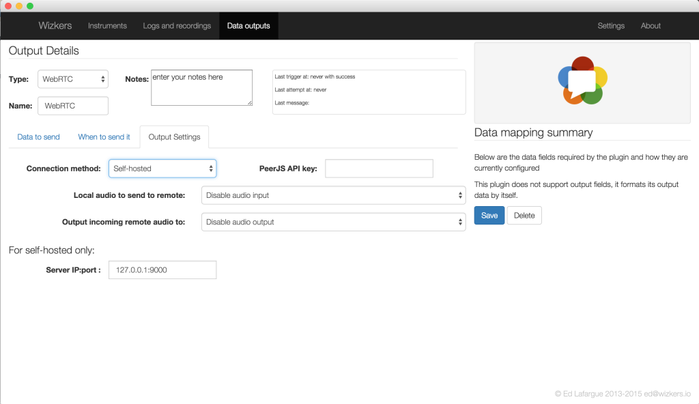

#WebRTC Output

This output plugin forwards all the data coming from the instrument over a WebRTC data channel. If can also send bidirectional audio to a remote end. The data channel is also bidirectional.

You can use this plugin in two different ways: display instrument data and do remote control from remote web pages, or connect to an instrument from Wizkers running on a remote computer. Think of it as "Wizkers to Wizkers" communication.

As of 0.9.19, you can use this Output for the Elecraft KX3 for remote operations: configure a “Elecraft KX3 Radio” instrument on a local Wizkers instance, then add the WebRTC output. Then, on another computer, create a “Remote KX3” instrument, which will let you connect to your KX3 remotely, including full duplex audio.

## Audio settings

If enabled, the WebRTC output will forward local audio to any peer connected to it, and will receive remote audio.

## Self-hosted vs PeerJS

The WebRTC is now working fine. But in order to establish communication between two peers, a broker service is required: we are using [PeerJS](http://peerjs.com/) to do this. The PeerJS seems to be a bit dormant at the moment and its broker service does not work. But PeerJS also provides everything you need to run your own broker service, and this is currently the recommended way of working with the WebRTC output.

Follow instructions on [Github](https://github.com/peers/peerjs-server) to run PeerServer on a local machine on your network.

Once your PeerServer is running, configure the WebRTC output as "Self-hosted" in the connection method, and put the IP:Port of the peer server in the "Server IP:Port" field.

## Interfacing a web page with the WebRTC Output

The WebRTC output uses the [PeerJS](http://peerjs.com/) library to implement a simple wrapper around WebRTC. This makes it easy to display instrument data on a remote web page.

TODO: create a detailed guide on how to implement an example web page once all the code is on github.

## Future evolutions of the WebRTC output

We are currently investigating running a Wizkers.io PeerServer for Wizkers users, which will make it a lot easier to use the output (no manual installation of PeerServer required). But self-hosting will always be supported anyway.