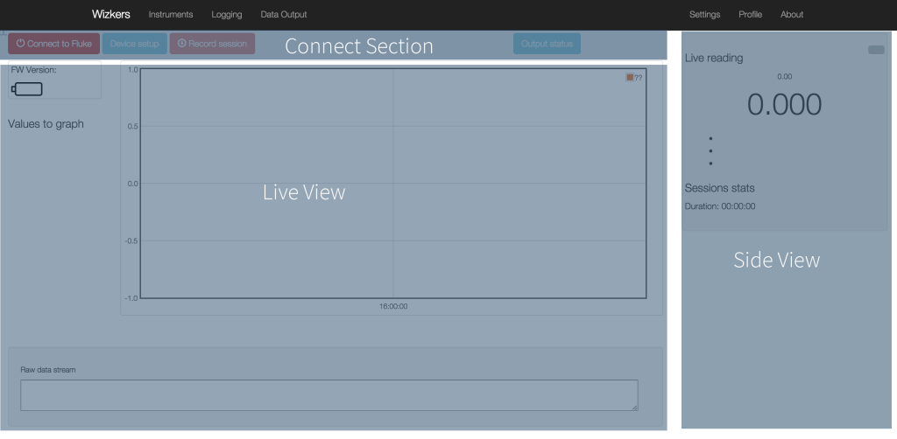
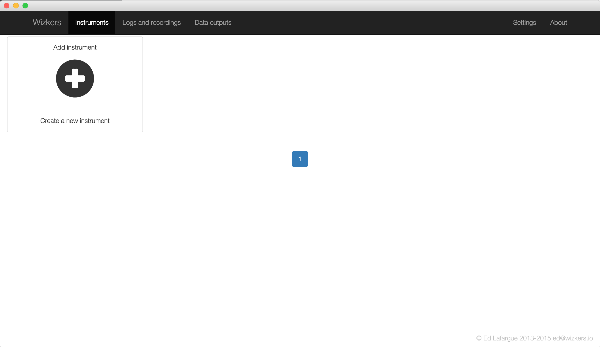
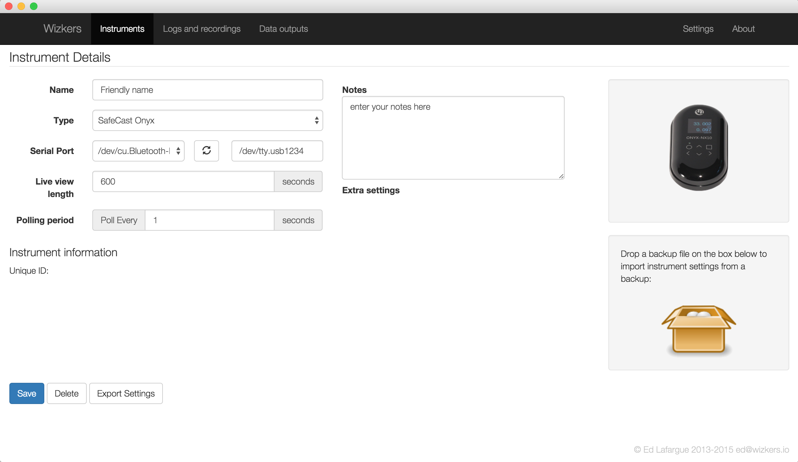
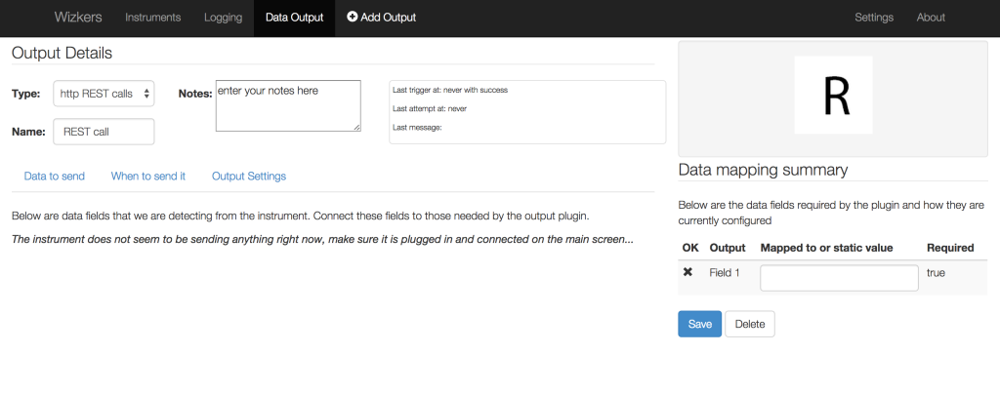
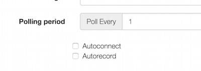

# Wizkers User documentation

Welcome to the user documentation of Wizkers. This section will help you make the most of the various capabilities of Wizkers.

# Home screen

The home screen contains three main zones:

* Connect/Setup/Record zone
* Main view / Live view
* Side view

The first time you start Wizkers, you will need to create a new instrument, as described in the next section.

## Connecting instruments

The top buttons are pretty much self-explanatory: the “Connect” button opens the connection to the instrument. The “Device Setup” button will only be enabled if the device supports a Setup screen (not all do). Last, the “Record Session” button lets you do a live recording of the data coming in from the device. You can view the logs that are saved there in the “Logs and recordings” screen.

# Configuring instruments

All instrument configuration is done on the “Instruments” screen. The first time you start the application, no instruments will be present. To create a new instrument, click on “Add Instrument” card:

After pressing “Add Instrument“, you will be presented with a blank configuration screen, as shown below. Some instruments display extra settings, but the following is always present:

First of all, give a “Friendly Name” to your instrument, and select the correct instrument type.

Depending on the instrument type, the "port" section will be different. Port can be:

* A serial port
* A bluetooth device
* A network address
* An API Key

Refer to the documentation of each instrument for more details on how to configure those fields.

The _Live view length_ option defines the time length of the the home screen live view - by defaults, Wizkers displays the last five minutes of data, or last 500 points.

_Polling period_ defines how often Wizkers requests information from the instrument. Some instruments will send data at their own rate, in which case this setting will be unused for that instrument.

# Logs and recordings

The Logs and recordings screen gives you access to all the recordings and logs saved on Wizkers, as well as an interface to download device logs if the currently connected instrument supports this.

# Outputs

Output plugins are one of the great features of Wizkers: using those plugins, you can automatically send the data generated by your instruments to various backend services.

At the moment, Wizkers ships with four output plugins:

* [Generic REST output](out/rest.md)
* [Safecast output](out/safecast.md)
* HAM Radio [“rigctld” emulation plugin](out/rigctld.md), for remote control of radios.
* [WebRTC Output](out/webrtc.md)

## Creating and configuring an output

All output plugins share quite a few settings: selecting what fields should be sent to the output, how often and with what conditions:

When you create an output from the “Data Output” screen (option on the top menu bar), you will see the screen below:

Note: you should be connected to the current instrument before creating an output, because the output plugin detects the data sent by the instrument for creating its configuration.

You can select the output plugin, give it a name and write notes in the top part of the window.

The section on the right tells you when the plugin was last triggered with success, when it last attempted to send data, and what the last message from the backend was. Very useful for debugging.

Then the screen contains three tabs: “Data to send”, “When to send it”, “Output Settings”. Only the last one (“Output Settings”) is plugin-specific, the first two are identical for all output plugins.

## Data to send

Again, you need to be connected to your instrument in order to be able to do anything with this screen. If not, it only displays a help message encouraging you to do so.

# Wizkers in server mode

In server mode, you connect to Wizkers by pointing your Chrome browser to the IP address of the computer running Wizkers.

In this mode, Wizkers will behave a little bit differently:

* It will enforce a simple user authentication mechanism
* It will support multiple open instruments at once
* It will keep all open instruments connected even when the user logs out of the interface

This makes it possible to use Wizkers for autonomous monitoring stations. When combined with local recording and output capabilties, this actually turns Wizkers into a pretty powerful system.

## User authentication

The first time you access Wizkesr through the network, a default `admin` user will be created. Wizkers will force you to change the default admin password before letting you access most of its functionality.

TODO: describe user roles

## Autorecord and autoreconnect

Wizkers is designed to be a very resilient system: when running by itself on small embedded devices, there can be situations such as power cuts which will lead the device to reboot. For this reason, in server mode you will see two extra flags on Wizkers on each instrument configuration screen:

Those two options are fairly self-explanatory: when the Wizkers server is started, it will go through all configured instruments, and automatically reconnect (and start recording) them according to those check boxes.

## Multiple open devices

While Wizkers in Chrome and Android modes only supports one open instrument at a time, you can open multiple instruments simultaneously in server mode, and simply switch from one to another without closing them. In the "Instruments" screen, you will see a little green badge next to all connected instruments.

